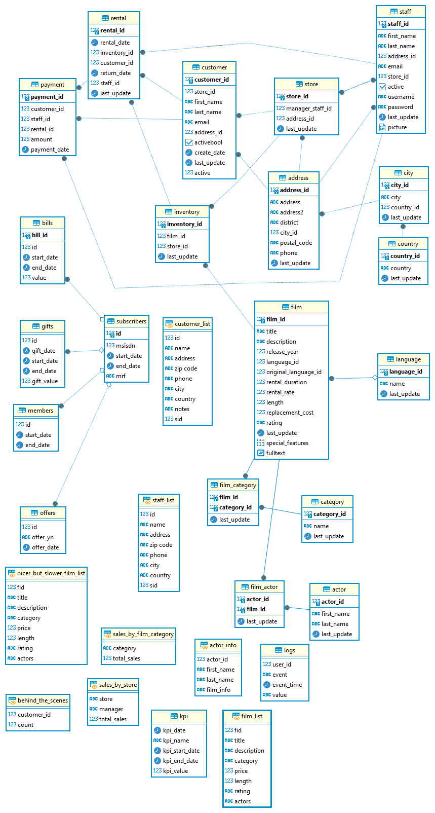

## **Задание 1:  [Задания по SQL ДЗ тестовое.xlsx](%C7%E0%E4%E0%ED%E8%FF%20%EF%EE%20SQL%20%C4%C7%20%F2%E5%F1%F2%EE%E2%EE%E5.xlsx).**

### Ответ: [Задания по SQL ДЗ тестовое_ответы.sql](%C7%E0%E4%E0%ED%E8%FF%20%EF%EE%20SQL%20%C4%C7%20%F2%E5%F1%F2%EE%E2%EE%E5_%EE%F2%E2%E5%F2%FB.sql)

## **Задание 2:  [Тех анализ дз тестовое.sql](%D2%E5%F5%20%E0%ED%E0%EB%E8%E7%20%E4%E7%20%F2%E5%F1%F2%EE%E2%EE%E5.sql).**

### Ответ: [Тех анализ дз тестовое_ответ.sql](%D2%E5%F5%20%E0%ED%E0%EB%E8%E7%20%E4%E7%20%F2%E5%F1%F2%EE%E2%EE%E5_%EE%F2%E2%E5%F2.sql)
